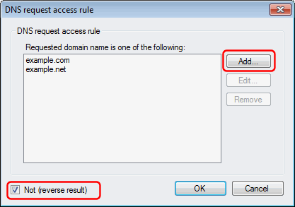

# How to whitelist domains for the Domain Blacklist plug-in

The following describes how to whitelist domain names (prevent specific domain names from being blocked) when using either the [Domain Blacklist plug-in](https://simpledns.plus/plugin-domainbl) with Simple DNS Plus v. 5.2 and later.

In the plug-in instance dialog, select the "DNS Requests" tab, in the "Process DNS requests" dropdown select "Only when...", click the "Add" button, select "Requested domain name" and "is in list...":

In the "DNS request access rule" dialog, click the "Add..." button and enter each domain name to be whitelisted.\
IMPORTANT: Check "Not (reverse result)".\
And click the "OK" button when done:

Back in the plug-in instance dialog, the new rule has been added:

If you need to add domains or make other changes to the whitelist, click the "Edit" button.
 
NOTE: Computers and Internet browsers cache DNS records, so if a web-site was blocked and you add it to the whitelist to gain access, you may also need to restart all browser instances and type `ipconfig /flushdns` at a command prompt on the local computer before you can access the web-site.