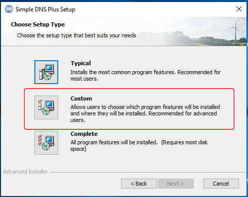

---
category: 11
frontpage: false
comments: true
created-utc: 2019-01-01
modified-utc: 2021-09-30
---
# Installing Remote Management client only

With Simple DNS Plus v. 5.2 and later, you can use the Simple DNS Plus GUI from a remote client PC.

To do so, Remote Management must first be enabled on the computer running the Simple DNS Plus service (see Options dialog / Remove Management section).\
The client PC must also have Simple DNS Plus installed - except it does not need the service part (see below).\
You can use the Windows Start menu / Programs / Simple DNS Plus / Remote Management link to connect to the remote service.

### Remote management licensing and activation

A license is required for and must be activated for each installed instance of the Simple DNS Plus service.\
Simple DNS Plus without the service (GUI, plug-ins, tools, etc.) can be installed on any number of computers and does not require a license or activation.

### Installing Simple DNS Plus without the service

In the "Choose Setup Type" step of the installation, choose "Custom":

Next, select NOT to install the "Core Service" feature:

### Plug-ins and remote management

It is important that the any plug-ins that you use on the service computer are also installed on the remote client computer.\
This includes the "Standard plug-ins" from the main installation (see above) as well as any downloaded and 3rd party plug-ins.\
And make sure to to use the same version of the plug-ins on both service and remote client PCs.\
Otherwise the remote client GUI will not be able to configure those plug-ins.

### Service / client versions

Remote management is designed to work between service and clients installation with different version/build numbers within a limited range defined by each version/build. Generally different versions/builds will be compatible as long of configuration files layout have not been altered in between.\
An error message will be displayed if the versions/builds are not compatible when you try to connect.
