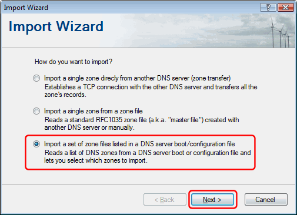
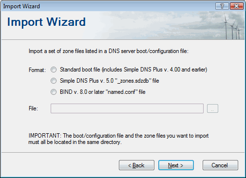

# Migrating zone data from another DNS server

Simple DNS Plus can import zone data from other DNS servers using standard zone files ([RFC1035](http://www.rfc-editor.org/rfc/rfc1035.txt)) / standard or BIND boot files.

### Importing from BIND

BIND is a popular DNS server used mostly on Unix/Linux.  
All versions of BIND store individual DNS zones in standard zone files.  
BIND versions 8 and later uses a proprietary boot file called "named.conf" file to list the zones to load. Earlier versions used a standard boot file (RFC1035).  
The Import Wizard in Simple DNS Plus can read both the "named.conf" format as well as the standard boot file format - see below.

### Importing from Microsoft DNS server

Microsoft's DNS server for Windows 2000 Server and later stores individual zones either in standard zone files (typically under 'c:\windows\system32\dns') or in Active Directory.  
The boot information (the list of zones to load) is stored in the Windows registry (default) or in a standard boot file.

### Importing from Microsoft DNS server - No zones stored in Active Directory

If the Microsoft DNS server that you want to import from does not store any zones in Active Directory, you just need to configure it to use a standard boot file - then you can import this and the zone files directly.  
From the MS DNS console, right-click the local server, select "Properties", select the "Advanced" tab, and change the "Load zone data on startup:" setting to "From File".  
This will generate a standard "Boot" file (again typically under 'c:\windows\system32\dns').

### Importing from Microsoft DNS server - One or more zones stored in Active Directory

Before you can import the DNS zones from such a server, you will first need to export the zones to standard zone files and create a standard boot file listing the zones.

For Windows Server 2003 and later, we have created a tool which can help you do this called "MsDnsExport" - available for download from <https://github.com/jhsoftware/MsDnsExport/releases>. For details on using this tool please see the README file at <https://github.com/jhsoftware/MsDnsExport>

With Windows 2000 Server, you need to check the properties of each zone and change zones of type "Active Directory-integrated" to "Standard..." - for each zone, and then configure the server to "load from file" as described above.

### Using the Import Wizard in Simple DNS Plus

To start the import process, in the Simple DNS Plus main window, click the "Records" button:

In the DNS Records window - select "Import..." from the File menu:

In the Import Wizard dialog, select the "Import a set of Zone Files listed in a DNS server boot / configuration file" option and click the "Next" button:

Select the type of boot / configuration file to import from, enter the location of the file, click the "Next" button, and follow the prompts to complete the import:

