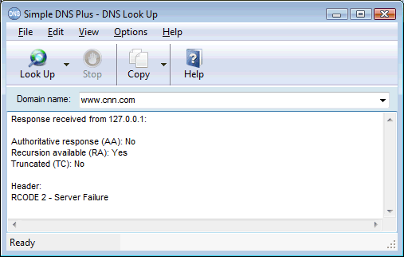
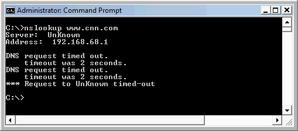
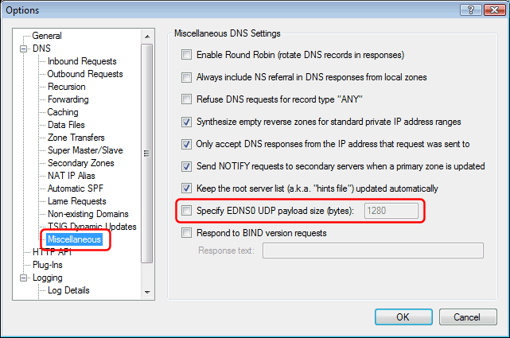

# Not resolving Internet domains / Returns RCODE 2 - Server Failure

In the Simple DNS Plus log, you will typically see it sending a number of requests to the root servers without getting any responses back and then eventually returning an RCODE 2 - Server Failure error:

If you do the lookup from the Simple DNS Plus DNS Look Up tool, the result looks like this:

And if you do the lookup from the command line NSLOOKUP tool, you will most likely get a time-out:

This situation is very often caused by firewalls - either a local software firewall on the same computer as Simple DNS Plus, or a hardware based firewall in front of it (anywhere upstream).  
For information on configuring firewalls for use with Simple DNS Plus, please see the [reference article](#kbref) below.

Even if you have opened the firewall ports etc., certain firewalls/routers with older firmware versions (including some Cisco PIX versions) will still block all "EDNS0" enabled DNS requests.  
EDNS0 is a relatively new addition to the DNS protocol not understood by older software/firmware.

Simple DNS Plus v. 5.0 has EDNS0 enabled by default. Previous Simple DNS Plus versions did not have this feature.  
So if you are experiencing this problem after upgrading to v. 5.0 from a previous version, there is a good chance that EDNS0 is the problem.

To test if EDNS0 is the problem, you can disable this in the Simple DNS Plus Options dialog / Miscellaneous section:

If Simple DNS Plus resolves Internet domain names after disabling this option, we highly recommend that you update the firmware on your router/firewall and then re-enable the EDNS0 option in Simple DNS Plus.  
The older firewall/router firmware is probably also blocking inbound EDNS0 enabled DNS requests - potentially preventing visitors from getting to your web-site etc.

