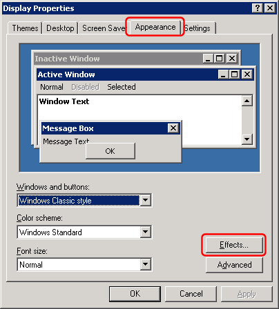
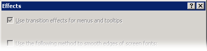
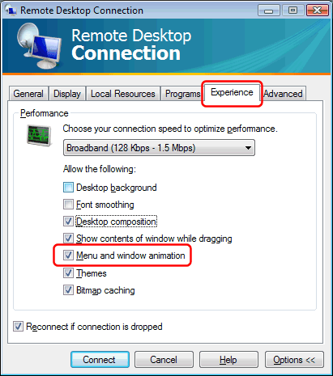

# Program menus slow when accessed through Remote Desktop / Terminal Services

The Simple DNS Plus users interface (GUI) uses transition effects for menus and tool tips (sliding / fading) for nice visual effects when this is enabled in Windows.  
However if you are accessing the server computer remotely through a slower connection (less than LAN speed) you may want to disable these effects for faster access.

Right-click anywhere on the remote desktop and select "Properties" from the popup-menu.

In the Display Properties dialog, select the "Appearance" tab, and then click the "Effects" button:

UN-check the "Use transition effects for menus and tool tips" option and click OK:

If the option is disabled like this:

\- then you need to disconnect the remote session and connect again with the Remote Desktop / Experience / "Menu and window animation" option ENABLED, and then repeat above:

The next time you use Remote Desktop you can change the Experience options back to whatever you need.

