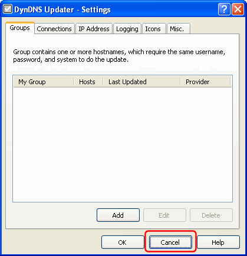
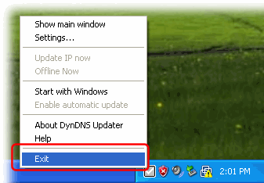
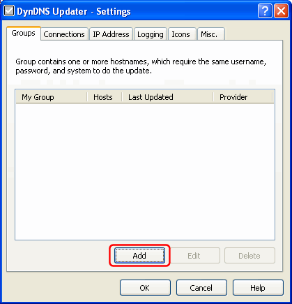
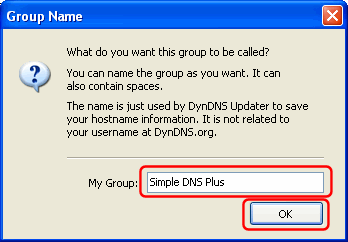
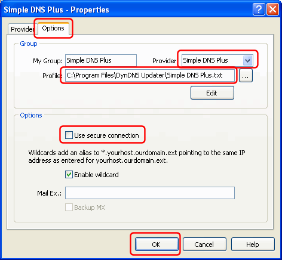
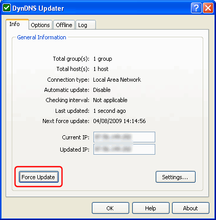
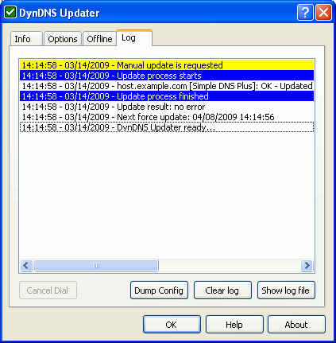

# Using DynDNS Updater with Simple DNS Plus

"DynDNS Updater" is a product by KanaSolution - [http://www.kanasolution.com](http://www.kanasolution.com){target=_blank}  
This tutorial was created using DynDNS Updater version 3.1.0.15.

You can use DynDNS Updater to automatically update DNS records on a remote Simple DNS Plus server - either using the [DynDNS Service plug-in](https://simpledns.plus/plugin-dyndns) or through the [HTTP API](/kb/115/sending-simple-dns-plus-http-commands) directly.  
This makes it possible to run different services (such as a web-server) on a computer with a dynamic IP address.  
You can also use this when you need to access roaming computers - for example traveling sales people with laptops.

If you use the DynDNS Service plug-in, you must enable the "HTTP - Basic HTTP Authentication" update method in the plug-in configuration.  
If you use the HTTP API directly, you must configure the HTTP API to listen on an IP address which can be accessed remotely (not the default 127.0.0.1) and set a password - see Simple DNS Plus Options dialog.

  
The first step in configuring DynDNS Updater is to disable DynDNS.org only mode (enables multiple provider support) in the "DynDNS.ini" file. This file is automatically created in the directory where DynDNS Updater is installed the first time the program is run. So run DynDNS Updater, and exit right away as follows:

In the DynDNS Updater Wizard dialog, click the "Cancel" button:

In the "DynDNS Updater - Settings" dialog, click the "Cancel" button:

Right-click the tray icon in the Windows notification area and select "Exit" from the pop-up menu:

Now open the "DynDNS.ini" file (in the directory where DynDNS Updater is installed) with Notepad, and add the line "IsDynDNS=0" immediately after the [Options] line, save the file, and exit:

Next we need to create a custom provider configuration file.  
Create a new text file (for example using Notepad) with the following contents and save this as "Simple DNS Plus.txt" in the directory where DynDNS Updater is installed:

For use with the DynDNS Service plug-in:

<pre></pre>
For use with the HTTP API directly:

<pre></pre>
Change the "host" setting to match the host name or IP address of the computer running Simple DNS Plus.

Now run DynDNS Updater again, and once again click the "Cancel" button in the "DynDNS Updater Wizard" dialog:

In the "DynDNS Updater - Settings" dialog / Groups tab, click the "Add" button:

In the "Group Name" dialog, enter "Simple DNS Plus" and click the "OK" button:

In the "Simple DNS Plus - Properties" dialog, enter username (must be "admin" with HTTP API) and password matching those in Simple DNS Plus, and click the "Add" button:

Enter the fully qualified host name that you want to update, set System to "custom", and click the "OK" button:

Back in the "Simple DNS Plus - Properties" dialog, select the "Options" tab, enter "Simple DNS Plus" in the Provider field (don't use dropdown - just type it), in the "Profile" field specify the provider configuration file created earlier, UN-check "Use secure connection", and click the "OK" button:

You may need to adjust other settings in DynDNS Updater to match your connection type etc.

Once configured, you can test the setup using the "Force Update" button in the DynDNS Updater window / Info tab:

If everything is setup correctly, the result (see "Log" tab) should look something like this:

