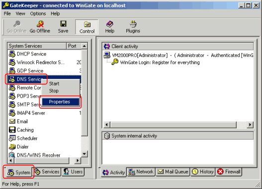
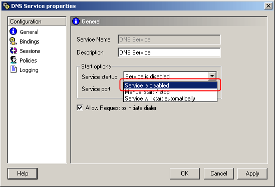
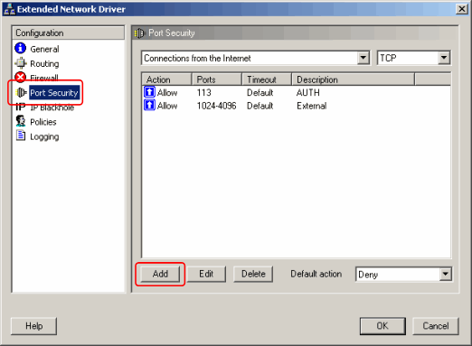

# Using Simple DNS Plus with WinGate

(WinGate is a product from QBIK - [www.wingate.com](http://www.wingate.com){target=_blank})

WinGate includes a DNS proxy or mapping function ("DNS Service") used to relay DNS requests from clients behind the proxy server.  
If WinGate and Simple DNS Plus are running on the same computer, this will conflict as both programs are trying to use port 53.

You can disable the DNS function in WinGate. You won't need this because Simple DNS Plus provides this functionality directly.

In WinGate GateKeeper - select the "System" tab, right-click on "DNS Service", and select "Properties":

As "Service startup", select "Service is disabled", and click the OK button:

After changing this setting, you should be able to start the DNS service in Simple DNS Plus (select "Start Server" from the "File" menu).

WinGate also includes firewall functionality which may block DNS requests from the Internet.  
If you want to host Internet domain names with Simple DNS Plus, you need to add the following configuration in WinGate to allow this:

In WinGate GateKeeper - select the "System" tab, right-click on "Extended Networking", and select "Properties":

Select "Port Security" in the left list and click the "Add" button:

Enter description "DNS server", check "Internet computers to WinGate PC", check both "TCP" and "UDP", enter ports 53 to 53, select "Allow Packet", and click the OK button:

