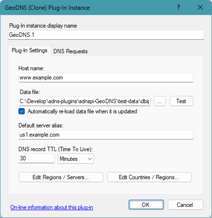
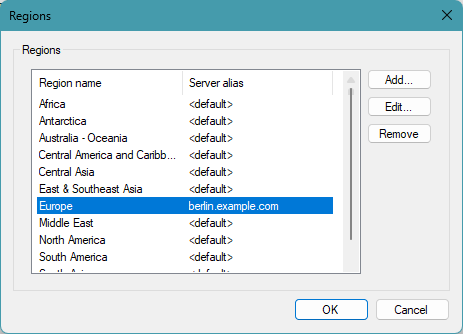
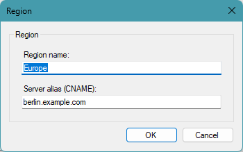
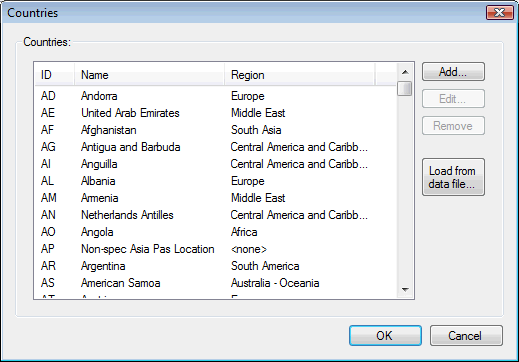
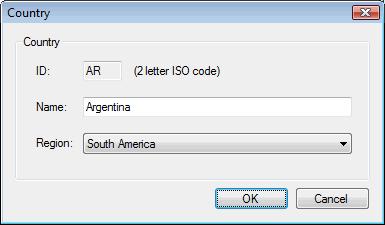
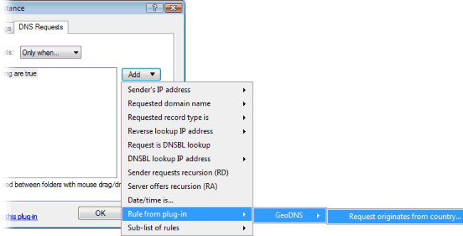

# GeoDNS plug-in

This plug-in provides a different DNS response depending on what country the DNS request originates from.

This can be used to direct Internet traffic (web, FTP, streaming media, etc.) to a server geographically closer to the end-user, or with contents specific for a geographical area.  
Note that this is based on the IP address of the resolving DNS server sending the DNS request, which could be in a different country than end-user. However most end-users will typically be using a DNS server in their own country.

To determine the sender's country, the plug-in uses an IP-to-Country database - see "Data files" below.

Countries are grouped into "regions" for each of which a unique server alias can be defined.
The plug-in is pre-configured with a default set of 10 regions (North America, Middle East, etc.) based on [CIA's World Factbook](https://www.cia.gov/the-world-factbook/){target=_blank}, but you can configure this in any way that you prefer.

There are two variants of the plug-in - "CNAME" and "Clone" - both included in the same .dll file.
The "CNAME" variant responds with a server name alias (CNAME-record).
The "Clone" variant responds with one or more cloned host records (A/AAAA records).  

**IMPORTANT:** The "Clone" plug-in variant requires an **Unlimited Zones license** for Simple DNS Plus.  
(the "CNAME" variant works with any license size)

The host name pointed to by this CNAME-record - or the cloned host records - may represent multiple IP addresses (multiple A/AAAA-records) defined elsewhere - for example a local or remote DNS zone or by another plug-in. 

On the "Plug-In Settings" tab, enter the following settings (explained below the image):

- **Host name**  
Enter the host name that you want to provide GeoDNS data for. For example "www.example.com".  
IMPORTANT: For the "CNAME" plug-in variant, always use a sub-name (like a "www." prefixed name) for which no other DNS records exist. Never use a zone name (such as "example.com") because the CNAME-record would conflict with the zone's SOA- and NS-records and cause various problems.  
If you want to allow end-users to enter your web-site address without the www prefix, you should use the "Clone" plug-in variant.
- **Data file**  
Specify the data file to use (see "Data files" below).  
Click the "..." button to browse the local file system and find the file.  
Click the "Test" button to get a count of IP address ranges and countries in the file, and to look up IP addresses in it.
- **Automatically re-load data file when it is updated**  
When checked, the plug-in will monitor the data file for updates.
- **Default server alias**  
The alias to serve / clone from if the country/region is not found or does not have a specific server IP address / alias defined.
- **DNS record TTL (Time To Live)**  
How long the DNS record served may be cached by other DNS servers / caches.
- **Edit Regions / Servers...**  
Click this button to open the Regions dialog where you can configure regions and map these to server IP addresses/aliases:

- **Edit Countries / Regions...**  
Click this button to open the Countries dialog where you can configure countries and map these to regions:

The GeoDNS plug-in can also be used as a source when setting up DNS request rules for other plug-ins:

For an example of using this for blocking DNS requests from specific countries, see [Blocking DNS requests from specific countries](/kb/6).

### Data files

As there is no standard for this, we developed our own data file format (`.geodns` files) - designed to be compact and fast to read into memory in a single pass (the whole database is kept in memory rather than randomly accessing the file).

For file layout specifics see <https://github.com/jhsoftware/sdnspi-GeoDNS/blob/master/data-file-format.md>

Several companies / web-sites provide IP-to-Country databases - both paid and free.

Two free options are:

<https://db-ip.com/db/download/ip-to-country-lite>

<https://dev.maxmind.com/geoip/geolite2-free-geolocation-data?lang=en>

The zip file containing the plug-in (see below) also contains utility programs (`convert-dbip.exe` / `convert-maxmind.exe`) which can convert the IP-to-country data files from these sites into the database format used by the plug-in.

To use these download the data file and run (for example):

`convert-dbip.exe  dbip-country-lite-2023-03.csv.gz  ipcountry.geodns`

`convert-maxmind.exe GeoLite2-Country-CSV_20230321.zip  ipcountry.geodns`

Do NOT unzip the source files first. The conversion utility will automatically decompress and extract relevant files.

Note: We recommend that you regularly update the data files as this data (IP address / country mappings) does change all the time.
