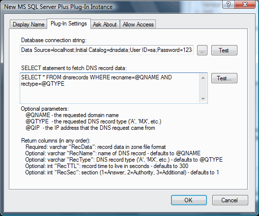
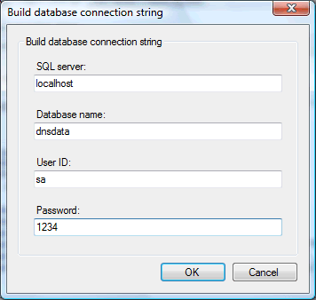
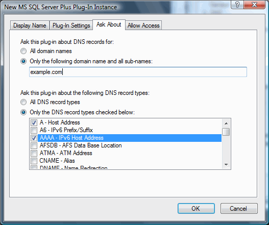

# MS SQL Server "Plus" plug-in

This plug-in queries a Microsoft SQL Server for one or more DNS records of any type.

The "Plus" in the title is to signal that this plug-in is more powerful (and more difficult to use correctly) than the original [MS SQL Server Plug-In](https://simpledns.plus/plugin-mssql).  
It is more powerful because it can be fetch multiple DNS records of any type, whereas the original can only fetch a single host or reverse record.  
This "Plus" version also requires an "unlimited zones" license for Simple DNS Plus, whereas the original works with any license size.

SQL queries are executed asynchronously (in a separate thread) and therefore won't slow down other requests not using the plug-in.

In the plug-in instance dialog / Plug-In Settings tab you can specify the database connection string and SQL SELECT statement to be used to fetch records:

A helper dialog is available to build the database connection string:

And in the plug-in instance dialog / Ask About tab, you can specify which domain name and record types the plug-in will be queried about:

There are no specific requirements for database table layout. You just need to be able to execute an SQL query which returns the required data. The query can be based on a table, view, stored procedure, or any other valid SQL expression.

Your SELECT statement may optionally include the parameters @QNAME (the requested domain name), @QTYPE (the requested DNS record type), and @QIP (the IP address where the DNS request came from).

Your SELECT statement must return a "RecData" column with DNS record data in zone file format, and can optionally return "RecName", "RecType", "RecTTL", and "RecSec" columns.  
It is important that the string data returned in the RecData column is in the correct format as defined by the DNS RFCs.  
For example the data for an MX-record might be: "10 mail.example.com." (without quotes), and for a TXT-record: "sample text" (WITH quotes).

NOTE: Serving data from directly from a SQL server with this plug-in can be very powerful, but keep in mind that querying a SQL server will never be as fast as serving DNS records directly from RAM, as Simple DNS Plus does when serving data from local zones. Therefore we recommend that you limit plug-in queries to only those specific domains and record types that you have stored in SQL.

