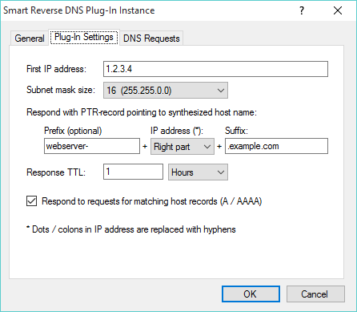

# Smart Reverse DNS plug-in

With this plug-in, Simple DNS Plus can automatically synthesize reverse DNS records (PTR) for all the IP addresses (IPv4 or IPv6) in a subnet.

This can be used if you manage a large number of IP addresses, and you need to provide generic reverse DNS records for these.

The plug-in will respond with reverse DNS records pointing to a synthesized host name in the format &lt;prefix&gt;&lt;ip-address-&gt;&lt;suffix&gt;. Dots and colons in IP addresses are replaces with hyphens, and you can choose to either include the full IP address, or just the right part (as per subnet size).

For example with the prefix "webserver-", the suffix ".example.com", and a DNS request for reverse DNS records for IP address 1.2.3.4 (PTR for "4.3.2.1.in-addr.arpa"), a PTR record pointing to "webserver-1-2-3-4.example.com" would be synthesized.

In the plug-in instance dialog / Plug-In Settings tab you can specify the following settings (below image):

- **First IP address**  
The first IP address of the subnet that you want to provide reverse DNS records for.
- **Subnet mask size**  
The mask size (in bits) of the subnet - larger the number = fewer IP addresses.
- **Respond with PTR-record pointing to synthesized host name**  
\- **Prefix (optional)**  
First part of the synthesized host name.  
\- **IP address**  
How much of the IP address should be included in the synthesize host name. Choose "Full" or "Right part".  
\- **Suffix**  
Last part of the synthesized host name.
- **Response TTL**  
For how long other DNS servers may cache the provided PTR / A / AAAA records.
- **Respond to requests for matching host records (A / AAAA)**  
Also respond to host record requests matching a host name that would be synthesized in PTR requests.

