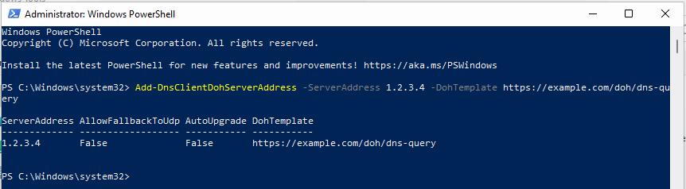
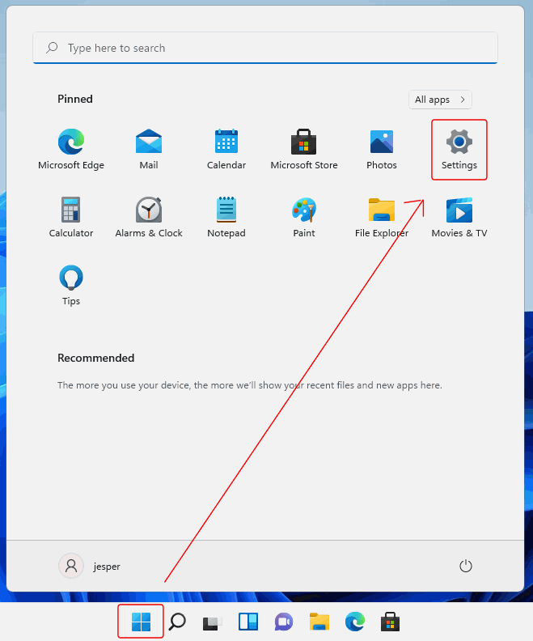
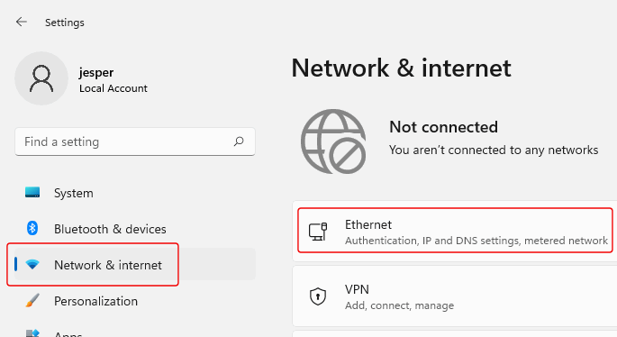
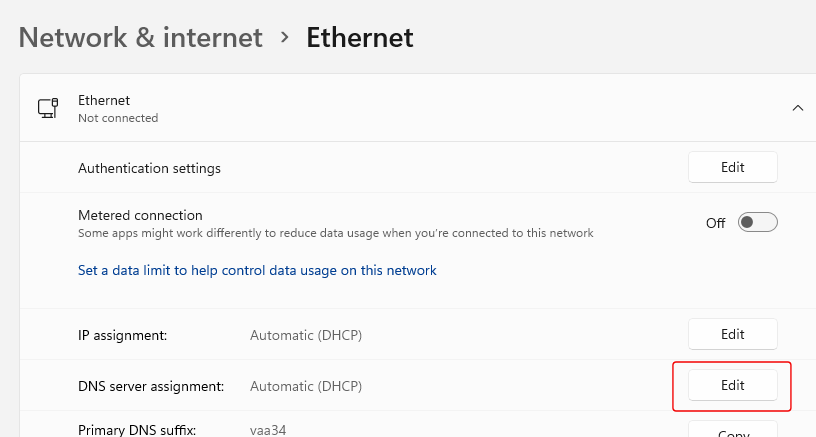

# How to enable DNS over HTTPS (DoH) in Windows 11

DNS over HTTPS (DoH) - or "DNS encryption" as it is called in Windows - is a way to encrypt DNS queries and responses between a user's device and the resolving DNS server. For more on this see [New in Simple DNS Plus v. 9.0](/kb/194).

To enable this in Windows 11, do the following.

Unless you are using one of the DoH DNS server pre-configured in Windows (Cloudflare, Google, Quad 9), you first need to add the DoH DNS server to the "list of known servers".

This is done in PowerShell with the command:

    Add-DnsClientDohServerAddress -ServerAddress '<resolver-IP-address>' -DohTemplate '<resolver-DoH-template>' -AllowFallbackToUdp $False -AutoUpgrade $True

For example if your DNS server IP address is `1.2.3.4` and its host name is `example.com`, and the DNS server is Simple DNS Plus, you would use:

    Add-DnsClientDohServerAddress -ServerAddress 1.2.3.4 -DohTemplate https://example.com/doh/dns-query

To do this, click the Search button on the Windows task bar, enter "powershell", click on "Run as administrator":

Enter the command from above:

Next, click the Windows Start button, and click on "Settings":

In the "Settings" dialog, select "Network & Internet" and click on your network connection:

Next to "DNS server assignment", click the "Edit" button:

In the "Edit DNS settings" dialog, select "Manual", turn it on for IPv4 and/or IPv6, under "Preferred DNS"  enter the IP address of your DNS server, and under "Preferred DNS encryption" select one of the "Encrypted..." options:

Note that the last setting ("Preferred DNS encryption) will only be available if you have completed the first steps above (adding the DNS server IP address to the "list of known servers" through PowerShell).

For more details about the "list of known servers", see Microsoft's documentation [Secure DNS Client over HTTPS (DoH)](https://docs.microsoft.com/en-us/windows-server/networking/dns/doh-client-support).
