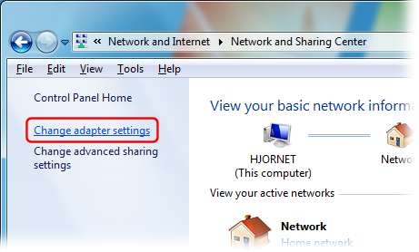
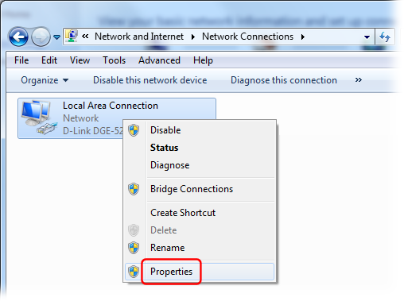
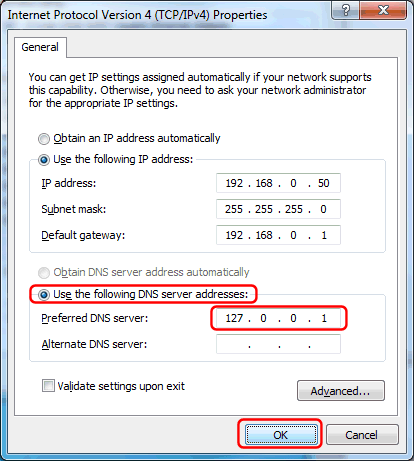

# Configuring Windows to use local DNS server (Windows 7 / Windows 8 / Windows Server 2012)

In the Windows Control Panel, under "Network and Internet", select "View network status and tasks":

Click "Change adapter settings":

Right-click your Internet connection's icon and select "Properties":

Select the "Internet Protocol Version 4 (TCP/IPv4)" item, and click the "Properties" button:

  

Select "Use the following DNS server addresses", and enter the IP address of the local DNS server (*) as the Preferred DNS server:

Finally click the "OK" button in this and the previous dialogs to save your changes.

(*) The DNS server IP address must match an IP address that Simple DNS Plus is configured to listen on in the Options dialog / DNS / Inbound Requests section.  
If you are configuring the computer which Simple DNS Plus is running on, you can use 127.0.0.1 (the "localhost" address) - otherwise you must use an IP address which is accessible over the local area network.

  
