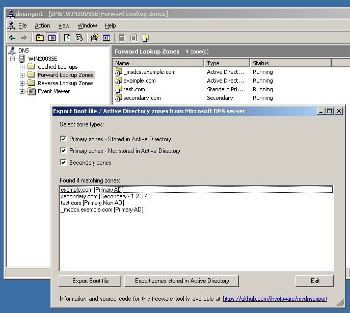

# MsDnsExport

### Export Boot file / Active Directory zones from Microsoft DNS server

This tool is especially useful if you have a large number of DNS zones stored in 
Active Directory and need to export these - for example for backup or for migration
to another DNS server platform.

### The tool can do two things:

* Generate a standard Boot file (very simple text file format which is understood
by most DNS servers / migration tools).
* Export all DNS zones stored in Active Directory to 
standard DNS zone files with just one click.

All exported files are saved to Microsoft DNS server's standard data directory -
typically 'c:\windows\system32\dns'.

### You probably **don't** need this tool if:

* None of your DNS zones are stored in Active Directory. In this case you can simply
configure Microsoft DNS server to 'load from file' 
(DNS Server managements console / Server Properties dialog / Advanced tab / Load zone data on startup / From file) -
which will generate a standard boot file.
* You only need to export a few zones from Active Directory. In this case just use 
`dnscmd.exe /ZoneExport <zone-name> <file-name>`

### Background

This tool was originally developed to make it easier for users migrating from Microsoft DNS to
[Simple DNS Plus](https://simpledns.plus), but it is released to the public domain and may
be used for any purpose.
  
### Requirements

* Windows Server 2003 or later with Microsoft's DNS server feature enabled.
* .NET Framework v. 2.0 / 3.5
  * On Windows Server 2003 this can be downloaded [from here](https://www.microsoft.com/en-us/download/details.aspx?id=1639).
  * On Windows Server 2008 and later this is a Windows features which can be enabled through Server Manager, Control Panel, etc.
* For exporting zones stored in Active Directory: the "dnscmd.exe" tool. 
  * On Windows Server 2003 this is part of the "Windows Support Tools" which can be found on the Windows installation CD - 
[instructions here](https://technet.microsoft.com/en-us/library/cc755948(v=ws.10).aspx).
  * On Windows Server 2008 and later it is installed automatically when the DNS Server feature is enabled.

### Download / Installation

Download the latest binary from <https://github.com/jhsoftware/MsDnsExport/releases> and run it.

### Source code / Git repository

See <https://github.com/jhsoftware/MsDnsExport>

Contributions are most welcome. Fork the repository, create a branch, commit your changes, push, and submit a pull request.
Or just e-mail us the changes :-)

