# Does Simple DNS Plus support split-horizon / split-view / BIND views?

Some DNS server implementations have a feature where you can have different versions of a zone served to different clients based on which IP address the DNS request originates from. This is often referred to split-horizon, split-view, or BIND views.

Typically this feature is used to handle the situation where clients on a private LAN need to access a server using a private IP address and clients from the Internet need to access the same server using a public IP address.

Simple DNS Plus does not have the ability to serve different versions of the same zone, but it does have a couple of features that allow you to serve different records based on the IP address origin of each request:

## NAT IP Alias

The simplest way to serve private/public IP addresses (as described above) is the "NAT IP Alias" feature, which is found in the Options dialog / DNS / NAT IP Alias section:

With the configuration show above - any request from 192.168.0.xxx for a host record that points to 1.2.3.4 - will be served a "cloned" host record pointing to 192.168.0.4.

So rather than maintaining duplicates of one or more zones, you can simply configure this in one place.

## Fixed IP Address plug-in

The NAT IP Alias feature (see above) provides one-to-one mapping between public and private IP addresses.

You may need more fine grained control - for example if you have different host names pointing to a single public IP address, but this is mapped to different internal IP addresses via NAT or reverse-proxy.

In this case, you can use the [Fixed IP Address](https://simpledns.plus/plugin-fixedip) plug-in.

Assuming that you have configured a normal DNS zone with your public DNS records, you can override these records individually for requests coming from your LAN using this plug-in.

For example to point "www.example.com" to 192.168.0.21 for users from 192.168.0.xxx (your LAN) only, you could setup a Fixed IP Address plug-in as follows:

From the main window, click the "Plug-ins" button:

Click the "Add" button:

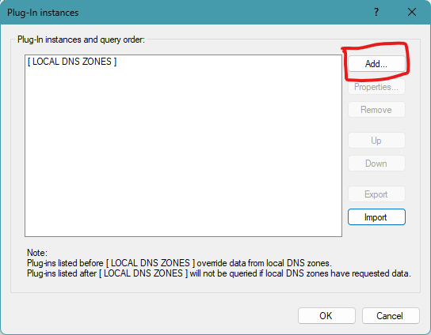

Select "Fixed IP Address" and click the "Create instance..." button:

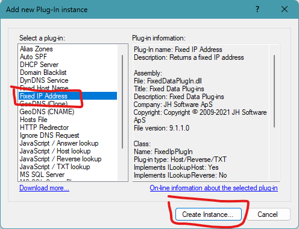

Enter the IP address "192.168.0.21" (the private IP address of the web-server):

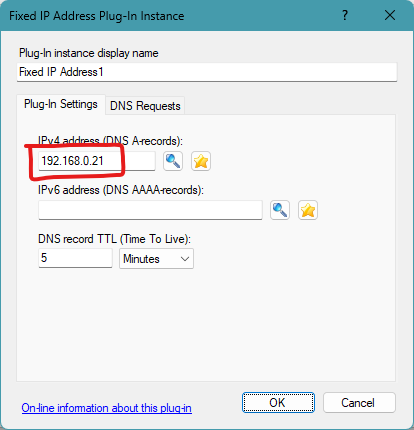

Click the "DNS Requests" tab, change the "Process DNS requests" drop-down to "Only when...", click the "Add" button, select "Sender's IP address", select "is in list..."

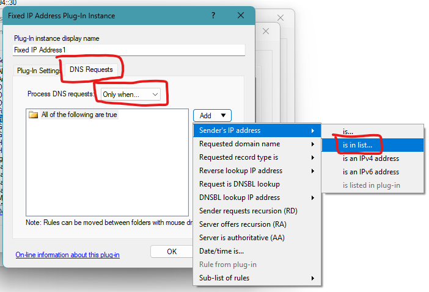

In the "DNS request access rule" window, click the "Add..." button:

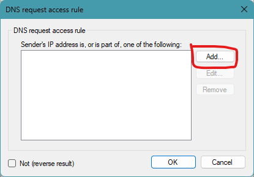

In the "IP address(es)" window, select "IP address subnet", enter the first LAN IP address "192.168.0.0", leave the subnet mask at "255.255.255.0 (/24)" and click the "OK" button:

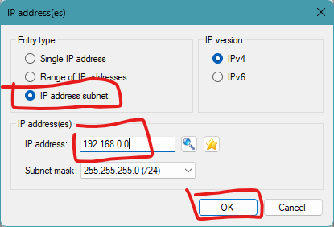

Also click the "OK" button in the "DNS request access rule" window.

Back in the "Fixed IP Address Plug-In Instance" window, click the "Add" button, select "Requested domain name", select "is...":

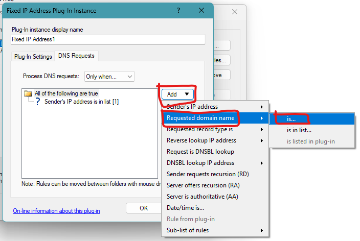

Enter the host name "www.example.com" and click the "OK" button:

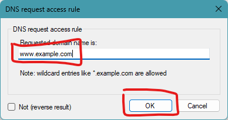

Back in the "Fixed IP address Plug-In Instance" window, click the "OK" button:

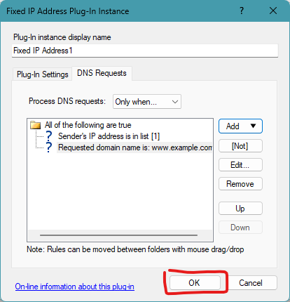

Back in the "Plug-in instances" window, select the new plug-instance and click the "Up" button, to have the plug-in process requests before local zones:

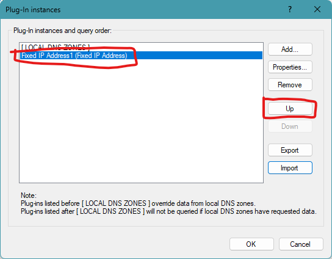

Finally, click the "OK" button:

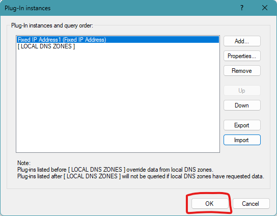

