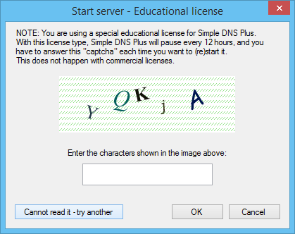

# Free educational licenses

We offer a special free license type for educational use - like classroom training and similar scenarios.

This license type is limited to 25 DNS zones per server, and Simple DNS Plus will pause every 12 hours. After pausing, it can be restarted immediately (for another 12 hours) by answering a "captcha":

These licenses may be installed on your students' personal computers for the duration of the related class / course - or permanently on institution owned computers.

To request such licenses (free), you must provide reasonable proof that you are teaching DNS / DHCP related subjects at an established educational institution. Contact us about this at <https://simpledns.plus/contact-us>

Note: This license type is not valid (or suitable) for running an educational institution's general DNS servers. For this you will need a regular license (we do not offer educational discounts for this purpose).

Note: This license type requires Simple DNS Plus v. 5.2 build 132 or later.