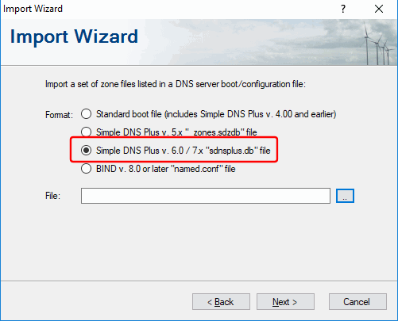
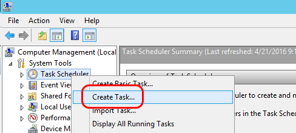
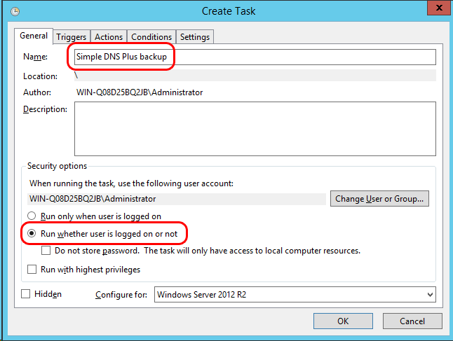
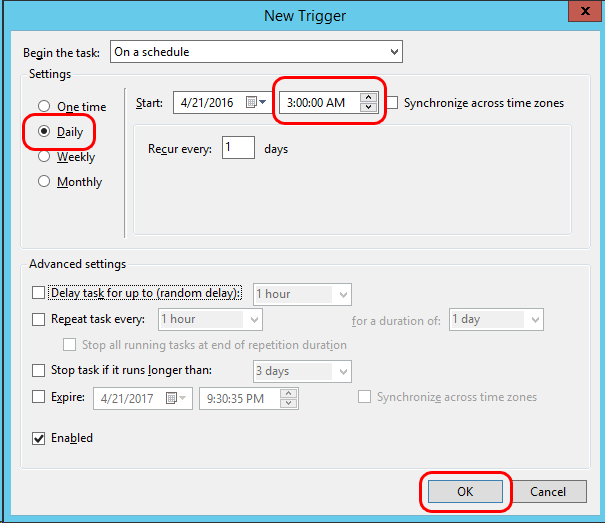
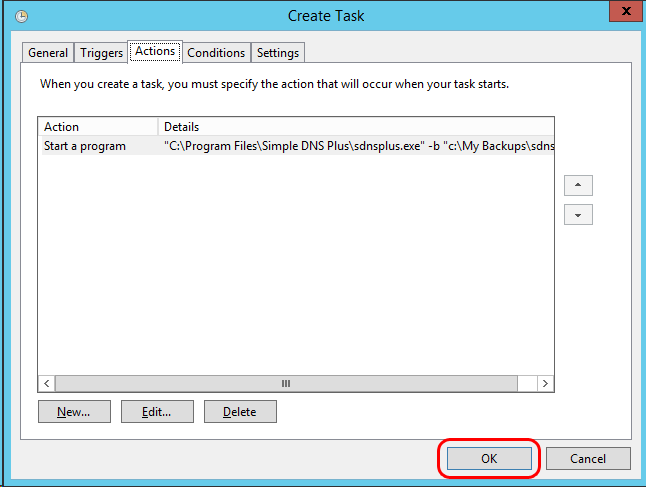

# How do I backup and restore Simple DNS Plus settings and data? (v. 6.0 and later)

### Which files to backup 

In Simple DNS Plus v. 6.0 and later, the DNS zones and records, and the different program settings (Options dialog etc.) are all stored in a single database file called "sdnsplus.db" in the Simple DNS Plus application data directory.

On Windows Vista / Server 2008 and later, this location is typically:\
`C:\ProgramData\JH Software\Simple DNS Plus`\
On earlier Windows versions:\
`C:\Documents and Settings\All Users\Application Data\JH Software\Simple DNS Plus`

### How to backup

You can shut down Simple DNS Plus, make a copy of the "sdnsplus.db" file, and that's your backup.

However, as it is likely not very convenient to shut down your DNS server at any schedule, Simple DNS Plus includes a command line option (-b) to make a copy of the database (at a safe point) while the program is still live and running.

For example:

`sdnsplus.exe  -b  "c:\my backups\sdnsplus.db"`

### How to restore - all data

To later restore this on a new or reinstalled computer, simply install a fresh copy of Simple DNS Plus, and copy the backup file to the Simple DNS Plus application data directory as "sdnsplus.db".

### How to restore - individual zones

In Simple DNS Plus v. 7.0 and later, you can import selected zones from a Simple DNS Plus database file / backup.

Click the "Records" button, then "File" menu, then "Import...", then "Import a set of zones listed in a DNS server boot/configuration file", then "Simple DNS Plus v. 6.0 or later "sdnsplus.db" file:

Click then "Next" button, select the zones to import, and follow the prompts.

### License

Your license is either stored in the "sdnsplus.db" file (see above), or in a separate "license.json" / "license.xml" file in the same location - depending on your version of Simple DNS Plus.

It is not stricly necessary to back up the "license.json" / "license.xml" file, as you can always re-activate the license (as long as you have your license key).

If you restore Simple DNS Plus to a new computer, your license will always need to be re-activated. 
For more on this, please see [How to move Simple DNS Plus to a new computer](/kb/69)

### Scheduling daily backups

You can of course also use above command line option as part of a backup script, or with Windows scheduler.

For example, to schedule a backup every night at 3:00 AM (on recent Windows versions), right-click the Windows Start button and select "Computer Management":

Right-click "Task Scheduler" and select "Create Task...":

Enter a name for the task, and select "Run whether user is logged on or not":

Select the "Triggers" tab and click the "New..." button:

Select "Daily" and enter "3:00:00 AM" and click the "OK" button:

Select the "Actions" tab and click the "New button":

In the "Program/script" field enter the path to sdnsplus.exe and in the "Add arguments" field enter "-b", space, and the path to the backup file (remember quotes if it contains spaces), and click the "OK" button:

Back in the "Create Task" window, click the "OK" button:

Enter your password, and the daily backup task has been scheduled:

Finally make sure to point your backup software to this backup folder.