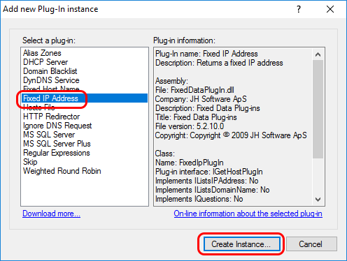
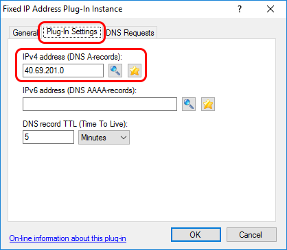
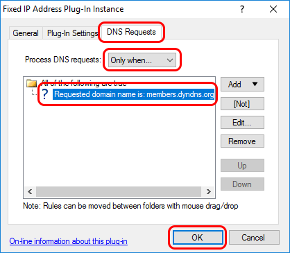
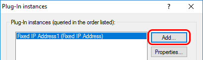
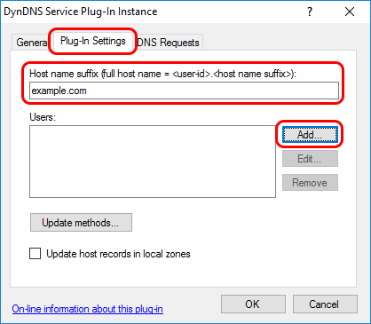
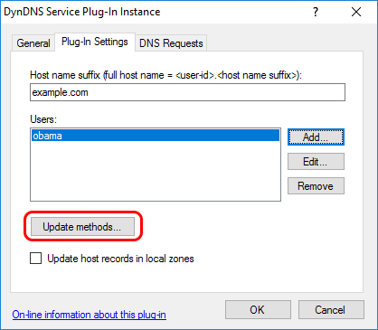
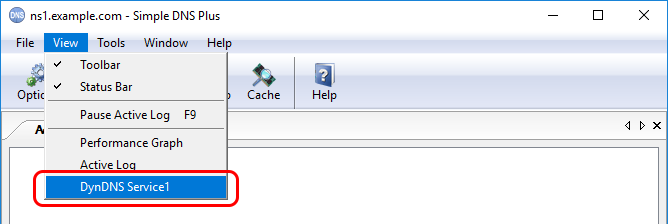
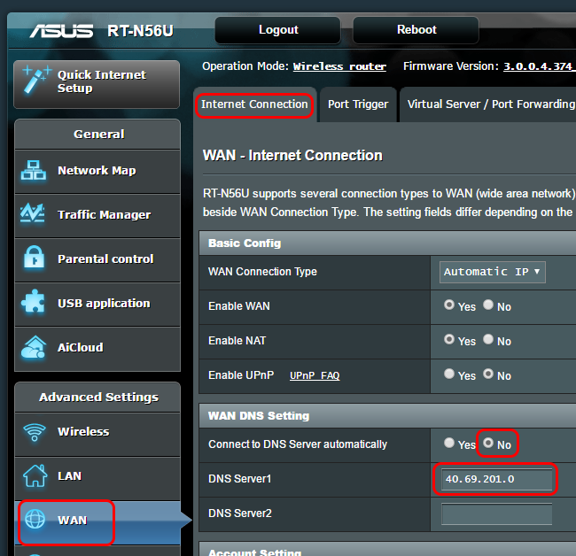

# How to intercept dyndns.org (Dyn.com) updates from Internet/NAT routers

Many Internet/NAT routers (and other devices) have a built-in function to update a dyndns service (a.k.a. "ddns") whenever the public IP address changes. This is often hard-coded to use a few specific dyndns providers / update formats, and dyndns.org (Dyn.com) is typically one of these.  
  
With Simple DNS Plus (on a public static IP address), you can run your own dyndns service and pretend to be dyndns.org (Dyn.com) - and have such routers update it.  
  
Note that this requires Simple DNS Plus v. 5.2 or later with the [DynDNS Service plug-in](https://simpledns.plus/plugin-dyndns){target=_blank} v. 5.2.30 (or later). This plug-in version comes with Simple DNS Plus v. 6.0 build 119 and later. For earlier Simple DNS Plus versions/builds, it can be downloaded from [https://github.com/jhsoftware/sdns-DynDns/releases](https://github.com/jhsoftware/sdns-DynDns/releases){target=_blank}  
  
With many routers, the dyndns.org (Dyn.com) update URL host name ("members.dyndns.org") is hard-coded, and so you need to "fake" the IP address for this in order to intercept update requests from the router. You can do this by configuring the router to use your own DNS server, and then have your DNS server point "members.dyndns.org" to your own server IP address - for example using the "Fixed IP Address" plug-in as described below.  
If your router allows you to specify the IP address of the dyndns server, then you should do so instead and skip the step below about configuring the router's DNS IP addresses.  
  
For the walk-through below, we have setup Simple DNS Plus on a computer with static IP address 40.69.210.0 and, in a different location, we have an ASUS RT-N56U Internet router in with a dynamic public IP address (80.62.117.233 at the time of this writing).  
On the firewall on / in front of the Simple DNS Plus computer, we have allowed UDP and TCP to port 53 (DNS requests) and TCP to port 80 (HTTP requests).  
  
On the DNS server computer, in the main window of Simple DNS Plus, click the "Plug-ins" button:  
  
  
  
In the "Plug-in instances" dialog, click the "Add" button:  
  
  
  
In the "Add new Plug-In instance" dialog, select "Fixed IP Address" and click the "Create Instance..." button:  
  
  
  
In the "Fixed IP Address Plug-In Instance" dialog, select "Plug-in Settings" tab, enter the public IP address of the the computer that Simple DNS Plus is running on:  
  
  
  
In the "DNS Requests" tab, under "Process DNS requests" select "Only when...", then add a rule for "Requested domain name is: members.dyndns.org" (click the "Add" button and select "Requested domain name", then "is...", then enter "members.dyndns.org"), and click the "OK" button:  
  
  
  
Back in the "Plug-In instances" dialog, click the "Add..." button again:  
  
  
  
In the "Add new Plug-In instance" dialog, select "DynDNS Service" and click the "Create Instance..." button:  
  
  
  
In the "DynDNS Service Plug-In Instance" dialog, in the "General" tab, check "Perform DNS recursion for IP addresses listed by this plug-in":  
  
  
  
In the "Plug-In Settings" tab, enter the host name suffix you want to use, and click the "Add..." button:  
  
  
  
In the "DynDNS Service User" dialog, enter a user-ID and a password (remember these for the router configuration) and click the "OK" button:  
  
  
  
Back in the "DynDNS Service Plug-In Instance" dialog, click the "Update methods..." button:  
  
  
  
In the "DynDNS client update methods" dialog, check "HTTP - Dyn.com URL format (Basic HTTP auth.), and click the "OK" button:  
  
  
  
Click the "OK" buttons in the previous dialogs. Back in the main window, in the "View" menu, select the DynDNS Service plug-in to open a new tab for this:  
  
  
  
At the client site, configure your router to use the public IP address of the computer running Simple DNS Plus for DNS.  
In our "ASUS RT-N56U" router, this is done in the "WAN" section, under the "Internet Connection" tab, under "WAN DNS Setting" as follows:  
  
  
  
Configure your router to use the dyndns.org (Dyn.com) service using the user-ID and password setup in Simple DNS Plus above.  
In our "ASUS RT-N56U" router, this is done in the "WAN" section, under the "DDNS" tab.  
Note that the "Host Name" setting / parameter is not used by the Simple DNS Plus plug-in and can be set to any value (such as "dummy"):  
  
  
  
  
If everything is configured correctly, you should now see a DNS request for "members.dyndns.org" followed by an DynDNS service update message, and the updated DynDNS user status / IP address in Simple DNS Plus:  
  
  
  
  
Please note:  
For above to work, the router must use the dyndns.org (Dyn.com) "Legacy Authentication URL".  
All routers that we have tested with so far do this.  
However in addition to the "Legacy Authentication URL", dyndns.org (Dyn.com) also provides another (newer) update URL which uses SSL (https://...). The specification for both URLs is available at [https://help.dyn.com/remote-access-api/perform-update/](https://help.dyn.com/remote-access-api/perform-update/){target=_blank} .  
So some routers may use the newer SSL version. It would not be possible to intercept such requests as this would require the private key of the SSL certificate for "members.dyndns.org".  
